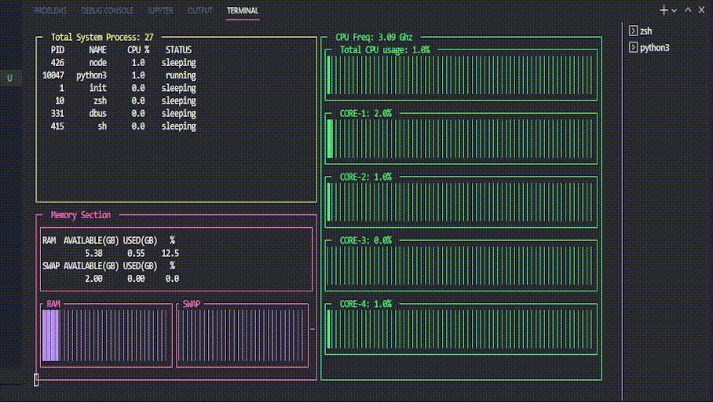

# Boas vindas ao repositório do projeto Python Process Analyzer!


Este projeto foi desenvolvido por [MarcusVMendes](http://www.linkedin.com/in/marcusvmendes-dev) para apresentação durante entrevista na empresa [PagBank PagSeguro](https://www.linkedin.com/company/pagbank-pagseguro/) #vqv 🚀

A proposta do projeto é interagir com os dados do sistema operacional Linux, tais como processos, memoria, cpu e apresentá-los dinamicamente em um dashboard no próprio terminal.

<br>
💡 Veja a seguir o exemplo de funcionamento do projeto:

<br>

<p align="center">
  
</p>


# Habilidades

- Utilizar o terminal interativo do Python
- Utilizar estruturas condicionais e de repetição
- Utilizar o tratamento de exceções
- Utilizar a formatação de strings do python
- Escrever os próprios módulos e importá-los em outros códigos.
- Utilizar a biblioteca [PsUtil](https://psutil.readthedocs.io/en/latest/) para coletar dados do sistema
- Utilizar a biblioteca [Py-Dashing](https://github.com/FedericoCeratto/dashing) para criar o dashboard

---

## Instalação do projeto localmente

Após cada um dos passos, haverá um exemplo do comando a ser digitado para fazer o que está sendo pedido, caso tenha dificuldades e o exemplo não seja suficiente, não hesite em me contatar em _marcus.mendes89@gmail.com_.

1. Abra o terminal e crie um diretório no local de sua preferência com o comando **mkdir**:
```javascript
  mkdir projetos
```

2. Entre no diretório que acabou de criar e depois clone o projeto:
```javascript
  cd projetos
  git clone git@github.com:MarcusVMendes/python-system-analyzer.git
```

3. Acesse o diretório do projeto e crie o **ambiente virtual** para o projeto:
```javascript
  python3 -m venv .venv && source .venv/bin/activate
```

4. Instale as dependências:
```javascript
  python3 -m pip install -r requirements.txt
```

5. Para executar o projeto, inicialize o arquivo **main.py**:
```javascript
  python3 main.py
```
---
OBS: Para finalizar a execução basta pressionar as teclas CTRL + C

<br>

